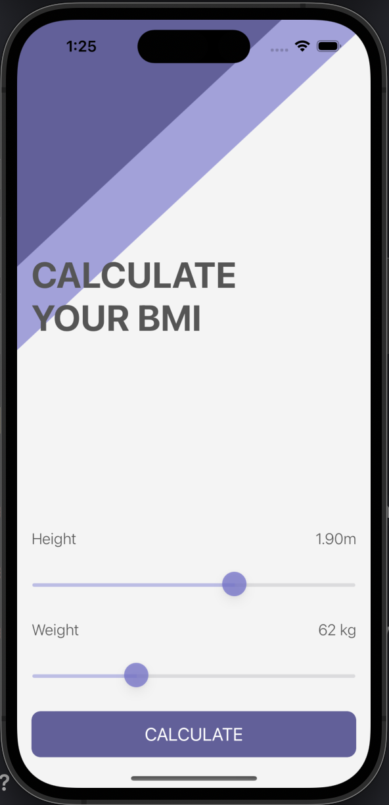
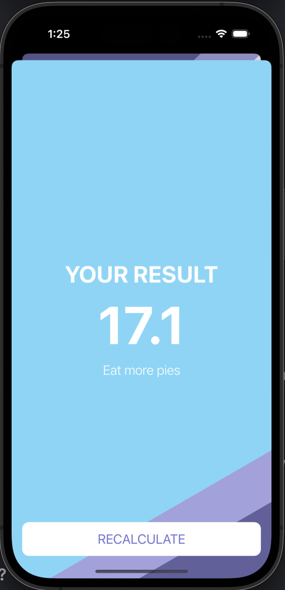
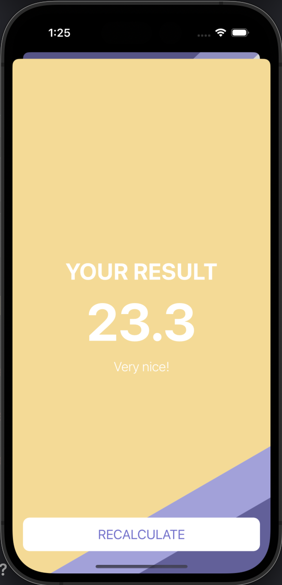
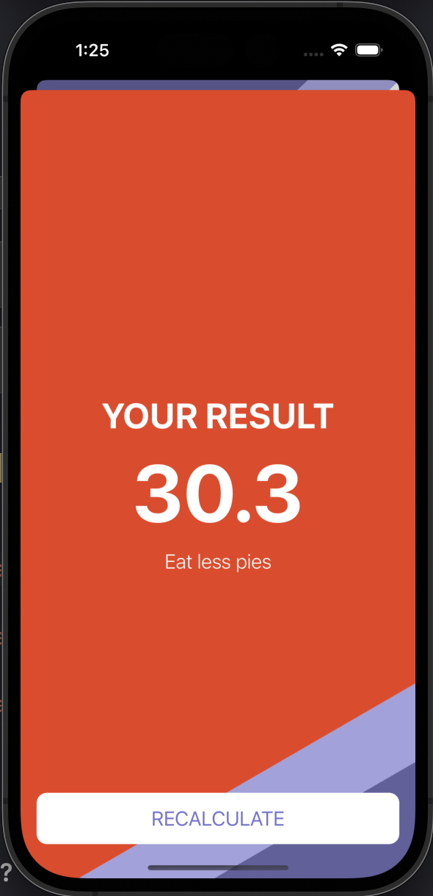

# BMI Calculator

* 사용자의 키, 몸무게 정보를 통해 BMI를 계산
* BMI에 따라 배경색, 문구를 다르게 표시
* MVC 패턴 적용, Segue를 통한 화면 전환
* Swift의 Class & Struct, Optional Binding, Optional Chaining 개념 학습
* Udemy의 'The Complete iOS App Development Bootcamp'를 수강하며 제작
* 본 Github 주소: https://github.com/appbrewery/BMI-Calculator-iOS13

 
 
