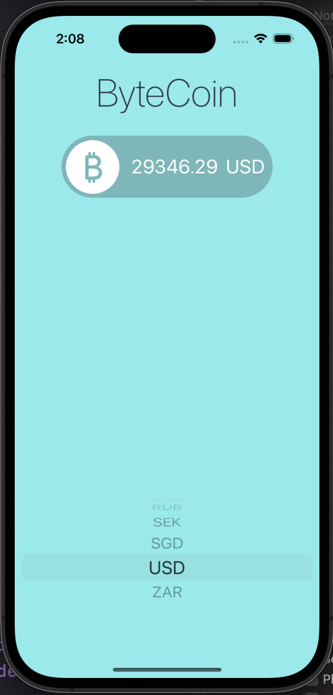
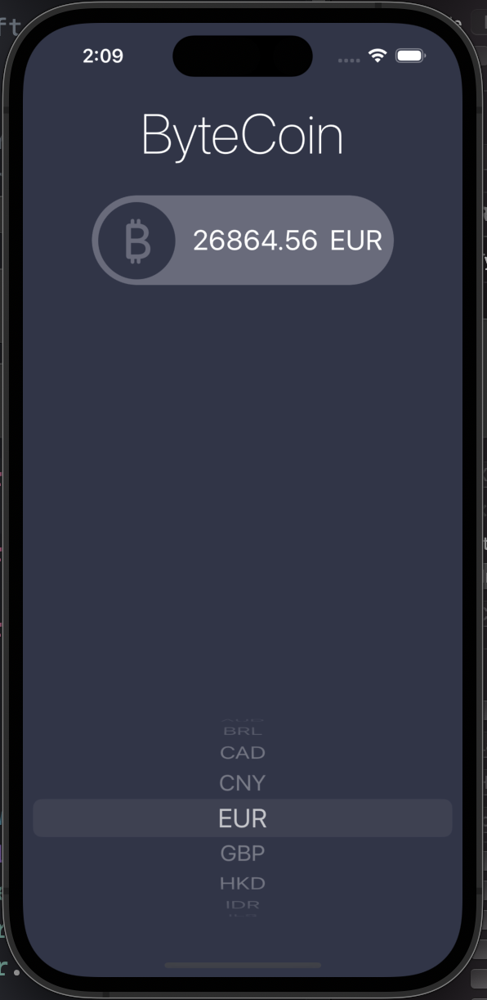

# ByteCoin

* 현 시각 기준 비트코인의 가격을 각종 통화로 환산한 금액을 보여주는 앱
* CoinAPI.io과 Networking, 라이트/다크 모드 전환
* Delegate Design Pattern 적용
* Swift의 Closures, Protocols, Extensions, Xcode의 Code Snippet 실습
* Udemy의 'The Complete iOS App Development Bootcamp'를 수강하며 제작
* 본 Github 주소: https://github.com/appbrewery/ByteCoin-iOS13

 

