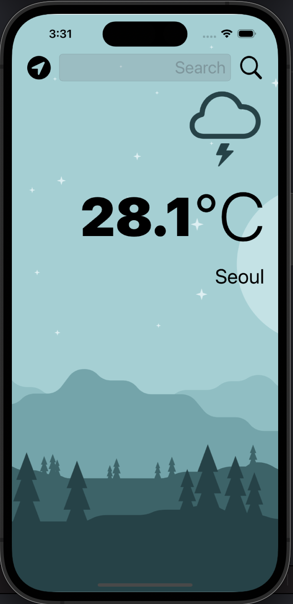
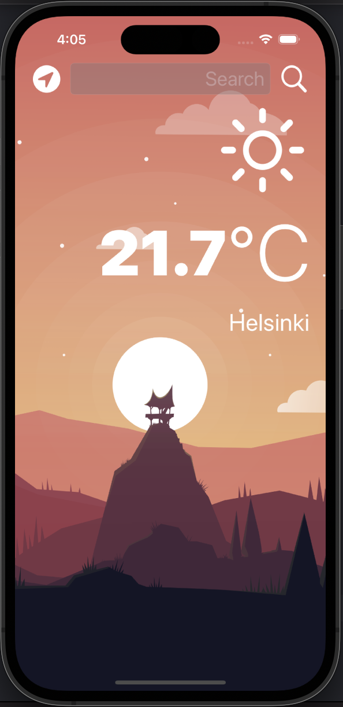

# Clima

* 현재 위치의 날씨 및 기온을 보여주는 앱
* Networking, 기기의 GPS 정보 사용, 라이트/다크 모드 전환, 벡터 이미지 사용
* Delegate Design Pattern 적용
* Swift의 Closures, Protocols, Extensions 학습
* Udemy의 'The Complete iOS App Development Bootcamp'를 수강하며 제작
* 본 Github 주소: https://github.com/appbrewery/Clima-iOS13

 
