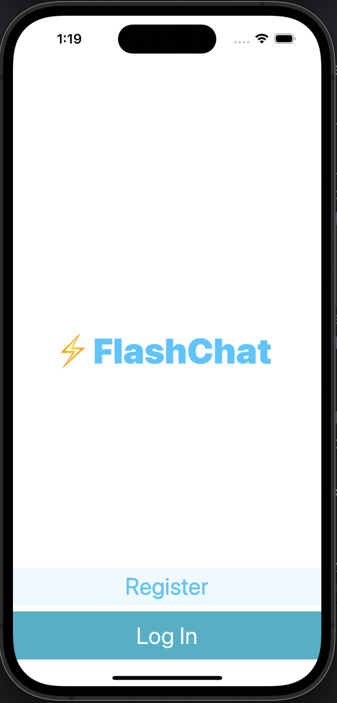
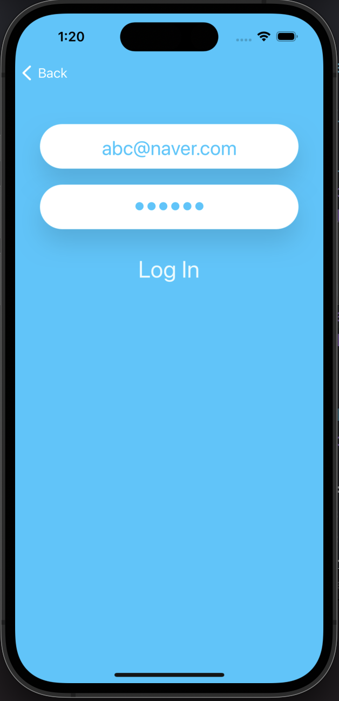
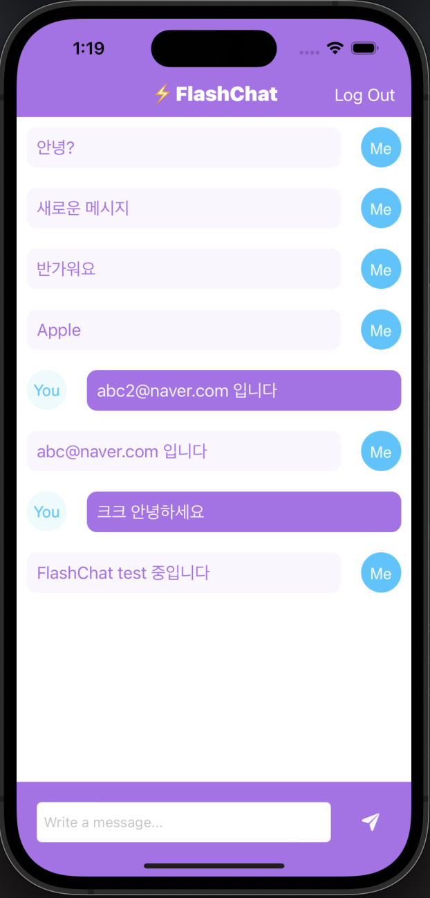

# Flash-Chat

* 채팅 앱
* Firebase 연동(회원가입, 로그인, 데이터베이스 접근), CocoaPods를 통해 라이브러리 추가, 디자인 파일(.xib) 생성, ViewController(+ App) Lifecycle 학습
* UI 개선(자동 스크롤 내리기, Navigation Controller 사용, 키보드가 입력창 가리지 않도록)
* Udemy의 'The Complete iOS App Development Bootcamp'를 수강하며 제작
* 본 Github 주소: https://github.com/appbrewery/Flash-Chat-iOS13

  
