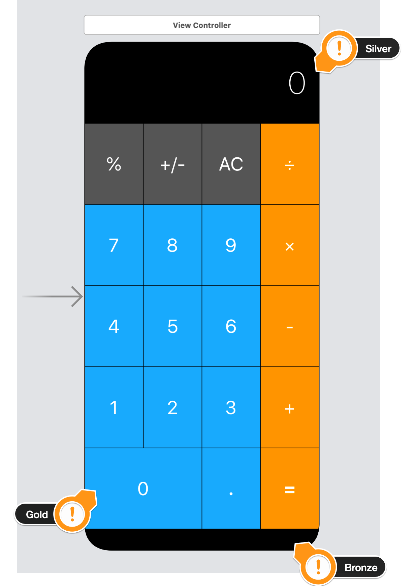

# Calculator Layout 적용

* AutoLayout 실습 -> StackView 사용, Constraints, Alignment, Distribution
* Udemy의 'The Complete iOS App Development Bootcamp'를 수강하며 제작
* 본 Github 주소: https://github.com/appbrewery/Calculator-Layout-iOS13
  
## Portrait

## Landscape

