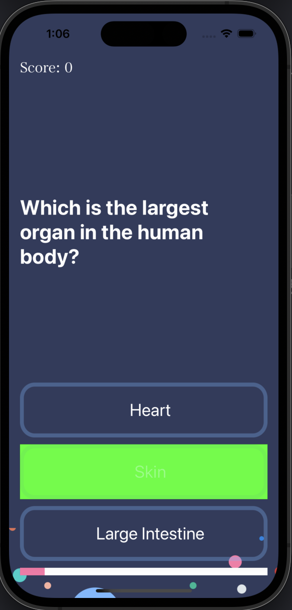
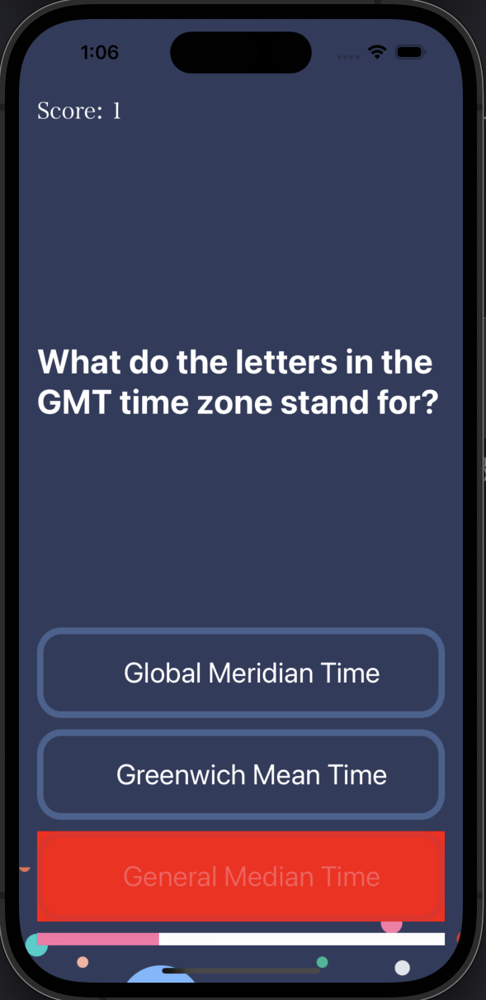
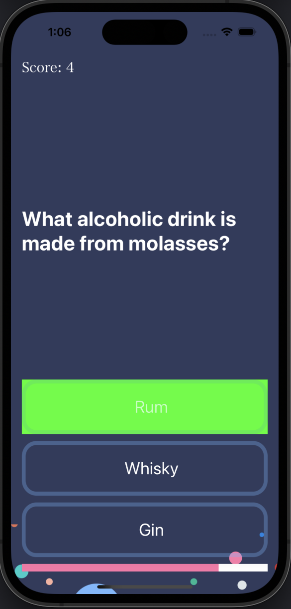

# Quizzler

* 퀴즈 앱 - 맞히면 초록색, 틀리면 빨간색으로 버튼 색상 변경, 상단에 맞힌 개수, 하단에 진행도
* MVC 패턴 적용
* Swift 문법 학습 - 구조체(struct), init(), mutating
* T/F 문제 -> Multiple Choice 문제로 변환
* Udemy의 'The Complete iOS App Development Bootcamp'를 수강하며 제작
* 본 Github 주소: https://github.com/appbrewery/Quizzler-iOS13

  
